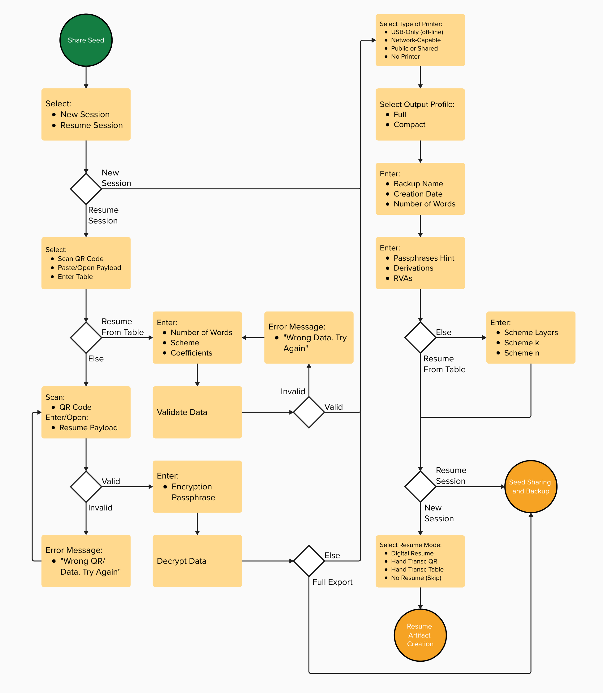
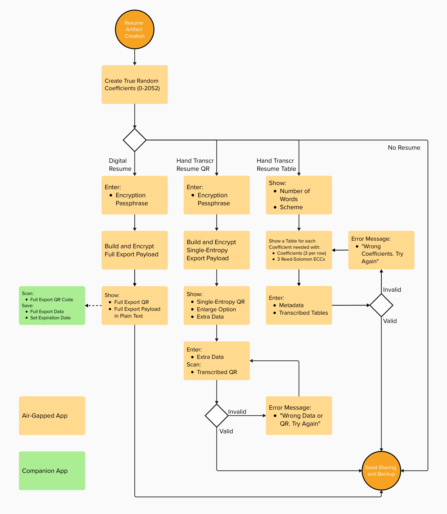
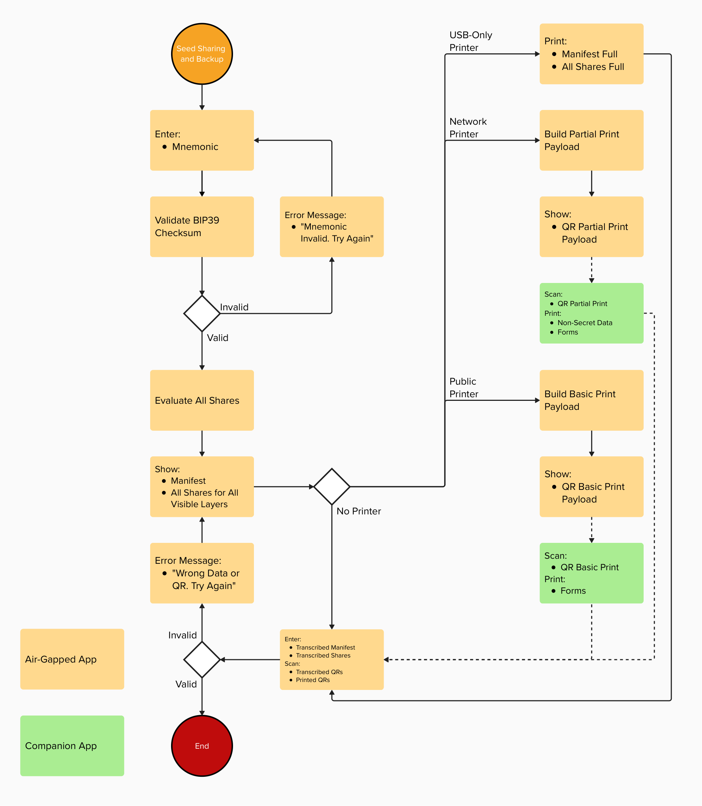

# Software Implementation Flow Diagrams

These diagrams are non-normative implementation aids for the software-assisted sharing flow. They are intended to help implementers and reviewers see the ceremony sequence, resume modes, printer-tier branching, and coefficient-generation paths in one place.

The normative sources remain:

- [`../../software_spec/README.md`](../../software_spec/README.md)
- [`../../manual_spec/README.md`](../../manual_spec/README.md)
- [`../../test_vectors/README.md`](../../test_vectors/README.md)
- [`../../whitepaper/WHITEPAPER.tex`](../../whitepaper/WHITEPAPER.tex)

## Constraints Shown In The Flows

The diagrams encode several operational constraints from the protocol. If a diagram and a normative spec ever diverge, the normative spec wins.

- USB-only offline printers may receive secret-bearing output; network-capable, public/shared, and no-printer paths require hand transcription of secret-bearing material according to the printer-tier rules.
- Full is recommended, but not forced, when a trusted offline printer is available.
- Compact is available for constrained-output paths where smaller QR transcription burden matters.
- All resume modes are available under both Output Profiles: Digital Resume, Hand Transcribed Table, Hand Transcribed QR, and No Resume.
- Digital Resume, Hand Transcribed Table, and No Resume use True Random coefficients. Hand Transcribed QR uses a 256-bit Deterministic Resume Key (DRK) with HMAC-SHA256 to derive coefficients.
- Resume artifacts are ceremony-continuity material only. They are not recovery inputs and are destroyed or separately secured after successful share creation and validation.

## Diagram Sequence

### 1. Sharing Setup

### 2. Resume Artifact Creation

### 3. Share Generation And Output

